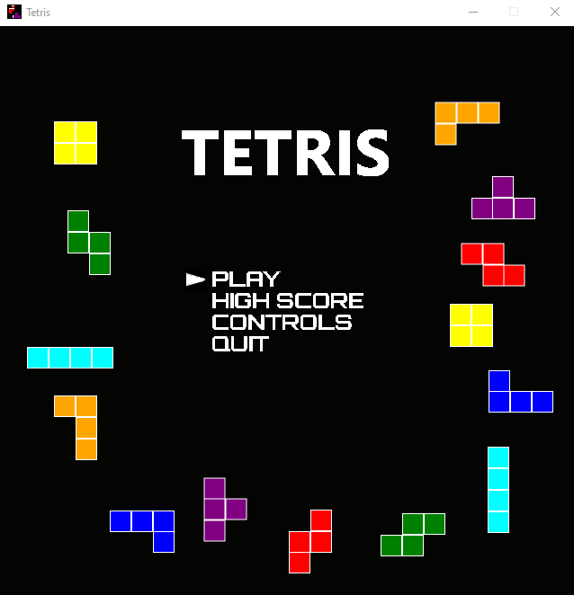
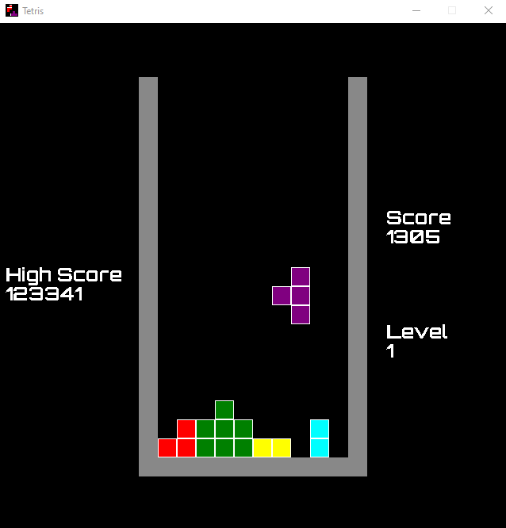

# Tetris_SDL

A Tetris clone made using the [SDL](https://www.libsdl.org/) development library.

### Dependencies

Tetris_SDL requires the following libraries:
- `SDL2` - latest releases [here](https://github.com/libsdl-org/SDL/releases/tag/release-2.28.2).
- `SDL2_ttf` - latest releases [here](https://github.com/libsdl-org/SDL_ttf/releases).

Versions of the required SDL2 libraries for Visual Studio are contained in the `dependencies` directory.

## Build in Visual Studio

1. Clone the repository.
1. Open the solution.
1. Build the `Tetris_SDL` project.

Build files are placed in the `bin` folder located in this directory.

## Future additions & improvements

Here are some ideas of how to add to the project.

- Add sound using the SDL mixer library
- Graphical enhancements
- Save highscores with player name
- Add support for non-Visual Studio builds
- Change console logging to a log file
- Create parent GameState class for MainMenu & Tetris classes